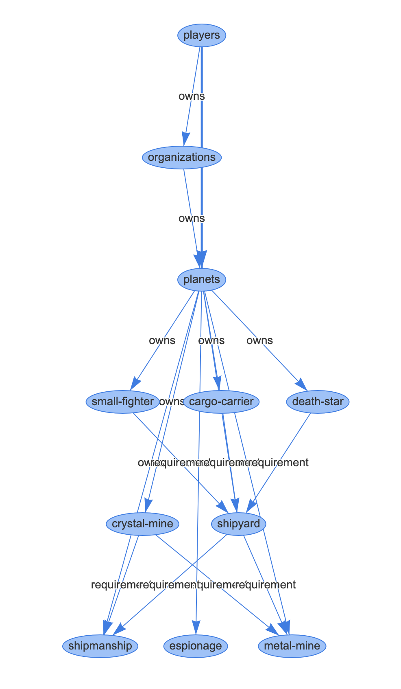

# Omen Engine


The backend server API, devoid of graphical elements in its core, but accompanied by a sample UI, operates primarily through configuration files (YAML). It facilitates the establishment of connections between various entities within your game and empowers you to leverage the API through a minimal UI layer (which you will need to create).

This approach allows you to prioritize user experience and gameplay, while minimizing the need to extensively focus on backend models, storage, and scalability concerns.

The engine possesses several capabilities, including the validation of configurations, providing visual representations of entity relationships, executing formulas, and much more.

Effectively, the system functions as an entity management system, enabling the definition of relationships between entities and utilizing formulas to derive attributes based on this hierarchical structure.

## Recommended usage pattern

Have a dedicated database that operates independently from the engine's default database. Utilize the engine API to facilitate the storage of entities with interconnected relationships, involving formulas between them. For instance, this can be applied to scenarios where a building necessitates certain player abilities at specific levels.

Leverage Omen to create an entity framework for societies, organizations, guilds, and even store their primary attributes, especially those related to game elements that may be utilized in future relationships. As an example, societies could potentially own buildings.

Make use of your own database for supplementary information storage. This can involve additional metadata about players or support functionalities such as player applications to join a society. With Omen, configure the system to add a player to a society only upon approval of their application.


## Sample YAML game definition

[Click here for sample from the codebase](./src/main/resources/game_configs/space.yaml)

The sample focuses on creating a space simulation browser based text game.

## Example game

An example [game UI has been implemented in PHP in this codebase](./src/main/php).

The game uses the space sample config, and leverages PHP as a trusted middle layer between the raw Omen API and the UI. The game-play/business logic is implemented in PHP, leveraging the API to achieve persistence and many of the generic functionalities.

## API

### Responses
All responses are in this JSON format:

```
{ "status": 200, "data": {} }
```

```
{ "status": 200, "error": "ERROR_MESSAGE" }
```

### Endpoints

| ENDPOINT                                     | ACTION | PARAMETERS                                     | DESCRIPTION                                         |
|----------------------------------------------|--------|------------------------------------------------|-----------------------------------------------------|
| ping                                         | GET    |                                                | Check status of server                              |
| configuration                                | GET    |                                                | JSON version of the YAML configuration              |
| player                                       | PUT    | Create new player entity                       | JSON version of the YAML configuration              |
| entities                                     | POST   |                                                | Find entities via a EntitiesQuery                   |
| entities                                     | PUT    | Create new entity                              | Create Entity                                       |
| entities/{entityId}                          | GET    | primaryParentEntityId?                         | Get entity info                                     |
| entities/{entityId}/upgrade                  | POST   | primaryParentEntityId?                         | Upgrade entity level                                |
| entities/{entityId}/ref/{key}/{value}        | POST   | primaryParentEntityId?                         | Update entity ref data                              |
| entities/{entityId}/attributes/{key}/{value} | POST   | primaryParentEntityId?                         | Update entity attributes                            |
| entities/{entityId}/requirements             | GET    | primaryParentEntityId?                         | Compute requirements and whether they are fulfilled |
| entities/{entityId}/requirements             | POST   | primaryParentEntityId? / amount?               | Apply attributes of fulfilled requirements          |
| tasks                                        | PUT    |                                                | Create Tasks                                        |
| tasks                                        | GET    |                                                | Create Task                                         |
| tasks/{taskId}                               | POST   | Acknowledge task                               | Acknowledge task completion                         |
| leaderboard                                  | GET    | id                                             | Get leaderboard by a specific type                  |
| tech-tree                                    | GET    | player_id? / parent_entity_id? / acknowledged? | Tries to generate a graph from the config           |

## Tests

There are tests for most of the functionality, mocking the entire database and simulating a player interracting with the system given a sample game configuration.

## Goals & Features
  * develop a game theme agnostic system for building browser based 2D games, not based on dialog, but on time sensitive tasks (building, upgrading, attacking, researching, farming)
  * allow for a scripting language which can define a game end to end with minimal programming, allowing for the description of the entire game economy (formulas, relations between entities, validation of API queries)
  * abstract away the need to account for thread safety, ranking, data-storage, handling of computations from the game development process, leaving the most important part (economy dynamics, story, graphics and UI) at the heart of the problem
  * automated testing which guarantees the inner working of the underlying engine
  
## Visualize the tech-tree and game config

An HTML endpoint is available which renders a visualisation of the entire config by using the `localhost:8083/tech-tree` endpoint at `localhost:8083/tech-tree/html`


