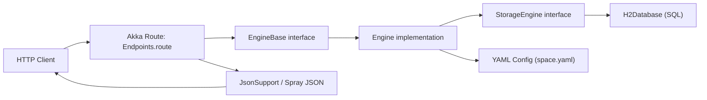

# Architecture and Code Connections

This page shows where the main code lives and how request handling, game logic, and persistence connect.

## Request Flow



## Key Code Files

| File | Role |
| --- | --- |
| `src/main/scala/core/Omen.scala` | App entry point; loads config and binds HTTP server |
| `src/main/scala/core/base/EngineBase.scala` | Abstract service contract used by routes |
| `src/main/scala/core/api/Endpoints.scala` | REST endpoints, parameter parsing, response envelope |
| `src/main/scala/core/impl/Engine.scala` | Core game logic (create/upgrade/requirements/tasks/hourly updates) |
| `src/main/scala/core/base/StorageEngine.scala` | Storage abstraction |
| `src/main/scala/storage/H2Database.scala` | H2-backed storage implementation |
| `src/main/scala/model/json/JsonSupport.scala` | JSON codecs for request/response model |
| `src/main/resources/game_configs/space.yaml` | Entity graph, requirements, formulas |
| `src/test/scala/SpaceGameTest.scala` | End-to-end route-level behavior tests |

## How Components Connect

1. `Omen.start()` creates an `Engine` and binds `engine.webRoutes.route`.
2. `Endpoints` receives HTTP requests and wraps successful responses as:

```json
{ "status": 200, "data": ... }
```

3. Route handlers call `EngineBase` operations (`createEntity`, `computeRequirements`, `tasks`, etc.).
4. `Engine` applies rules from YAML config (`space.yaml`) and computes formulas/requirements.
5. `Engine` persists and queries through `StorageEngine`; `H2Database` handles SQL storage.
6. `JsonSupport` and model protocols serialize Scala case classes to/from JSON.

## Concrete Example: Upgrade Flow

1. Client calls `POST /entities/{entityId}/upgrade/{to}`.
2. `Endpoints` resolves the entity and invokes `omen.upgradeEntity(currentEntity, to)`.
3. `Engine.upgradeEntity` increments `amount` and calls `storageEngine.save(...)`.
4. `H2Database.save` updates the `entities.amount` row.
5. Response is returned under the standard envelope.

## Source Links

- [core/Omen.scala](https://github.com/nenuadrian/omen-scala-browser-game-generic-api/blob/master/src/main/scala/core/Omen.scala)
- [core/api/Endpoints.scala](https://github.com/nenuadrian/omen-scala-browser-game-generic-api/blob/master/src/main/scala/core/api/Endpoints.scala)
- [core/impl/Engine.scala](https://github.com/nenuadrian/omen-scala-browser-game-generic-api/blob/master/src/main/scala/core/impl/Engine.scala)
- [storage/H2Database.scala](https://github.com/nenuadrian/omen-scala-browser-game-generic-api/blob/master/src/main/scala/storage/H2Database.scala)
- [model/json/JsonSupport.scala](https://github.com/nenuadrian/omen-scala-browser-game-generic-api/blob/master/src/main/scala/model/json/JsonSupport.scala)
- [test/SpaceGameTest.scala](https://github.com/nenuadrian/omen-scala-browser-game-generic-api/blob/master/src/test/scala/SpaceGameTest.scala)
