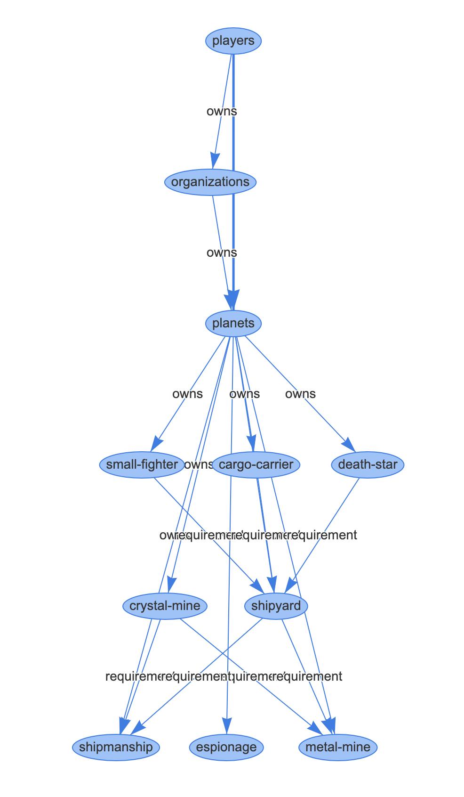

# Omen Engine

Omen Engine is a Scala backend API for browser-based games where game mechanics are primarily defined through YAML configuration.

It is designed to let you focus on gameplay and user experience while the engine handles:

- Entity relationships and hierarchy
- Formula-based attribute computation
- Configuration validation
- Generic persistence and API behavior

## Example usage

The repository includes:

- A sample YAML game definition at `src/main/resources/game_configs/space.yaml`
- A sample PHP UI layer at `src/main/php/`
- Automated tests that simulate gameplay behavior
- A code architecture walkthrough in `Architecture & Code`

## Visualized tech tree

You can render the game configuration graph via the `tech-tree` endpoint.

